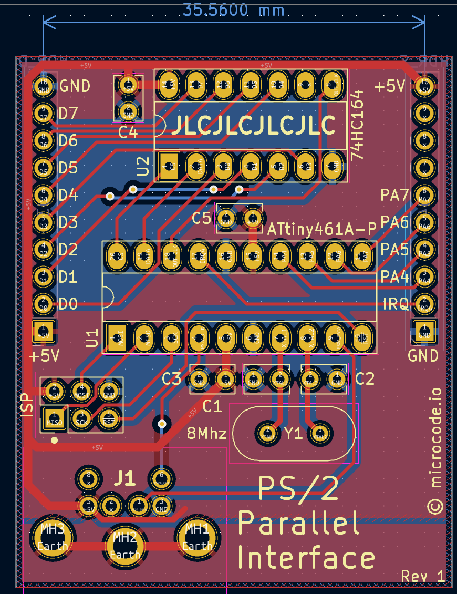
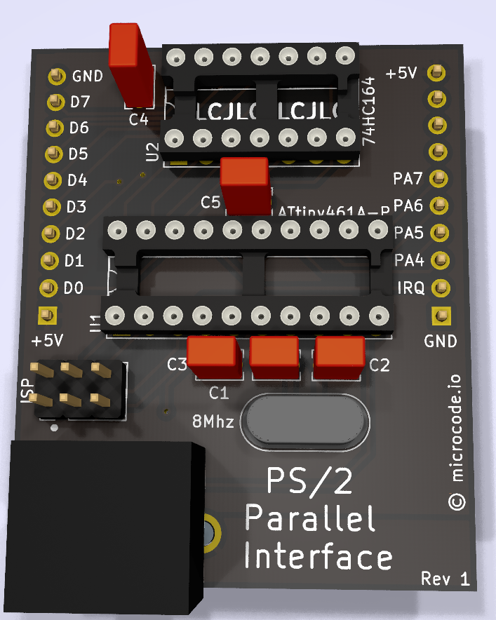

# PS/2 to Parallel Breakout Board

I wanted to learn about the PS/2 protocol by building a circuit to convert it from serial to parallel. I chose to use an ATTiny461A to control a PS/2 port and a 74HC164 shift register for parallel output.

## Current Design

